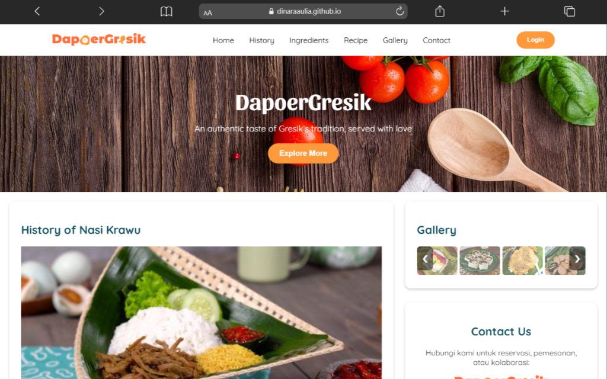

# 🍚 Dapoer-Gresik: Kuliner Khas Kota Santri



## 🌟 Overview

**Dapoer-Gresik** adalah *website company profile* informatif yang didedikasikan untuk memperkenalkan dan melestarikan kekayaan kuliner tradisional khas Gresik, Jawa Timur—sering dijuluki Kota Santri.

Website ini dirancang untuk menjadi sumber daya utama bagi siapa pun yang ingin mengenal lebih dalam tentang warisan rasa dari Gresik, mencakup aspek sejarah, bahan-bahan, hingga resepnya. Proyek ini dikembangkan menggunakan teknologi dasar *front-end* murni, memastikan performa cepat dan desain yang responsif.

## ✨ Fitur Utama (Key Features)

* **Sejarah Kuliner (History):** Menyajikan narasi mendalam tentang asal-usul hidangan khas Gresik.
* **Bahan-bahan (Ingredients):** Menyediakan daftar lengkap bahan-bahan utama yang digunakan dalam hidangan lokal.
* **Resep (Recipe):** Panduan langkah demi langkah yang mudah diikuti untuk membuat hidangan khas Gresik di rumah.
* **Galeri Visual (Gallery):** Koleksi foto kuliner berkualitas tinggi untuk mempromosikan hidangan lokal.
* **Kontak Kami (Contact Us):** Form kontak sederhana untuk memfasilitasi komunikasi.
* **Desain Responsif:** Layout dioptimalkan agar tampilan sempurna dan *user-friendly* di berbagai perangkat (desktop, tablet, dan *mobile*).

## 🛠️ Teknologi yang Digunakan

Proyek ini dibangun murni menggunakan bahasa dan teknologi dasar *front-end*, tanpa *framework* kompleks, untuk fokus pada performa dan aksesibilitas.

* **HTML5:** Untuk struktur dasar dan semantik konten.
* **CSS3:** Untuk styling dan kustomisasi desain, termasuk penggunaan *Flexbox* dan *Grid* untuk responsivitas.
* **JavaScript (JS):** Untuk menambahkan interaktivitas, seperti navigasi *mobile* dan efek visual.

## 💻 Instalasi dan Penggunaan

Anda dapat mengunduh dan menjalankan proyek ini di lingkungan lokal Anda dengan mudah.

### Persyaratan

Hanya membutuhkan *web browser* modern (seperti Chrome, Firefox, Edge, atau Safari).

### Langkah-langkah

1.  **Clone Repositori:**
    ```bash
    git clone [https://github.com/DinaraAulia/Dapoer-Gresik.git](https://github.com/DinaraAulia/Dapoer-Gresik.git)
    ```
2.  **Masuk ke Direktori Proyek:**
    ```bash
    cd Dapoer-Gresik
    ```
3.  **Buka di Browser:**
    Buka file `index.html` langsung dari direktori proyek menggunakan *web browser* Anda.

## 🤝 Kontribusi

Kontribusi Anda untuk perbaikan kode atau penambahan konten sangat kami hargai!

1.  *Fork* repositori ini.
2.  Buat *branch* fitur baru (`git checkout -b feature/nama-fitur-baru`).
3.  *Commit* perubahan Anda (`git commit -m 'Tambahkan Fitur [Nama Fitur]'`).
4.  *Push* ke *branch* (`git push origin feature/nama-fitur-baru`).
5.  Buka *Pull Request*.
